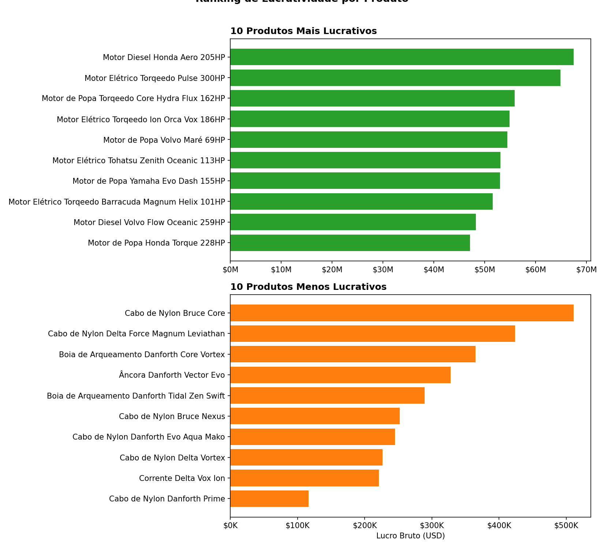
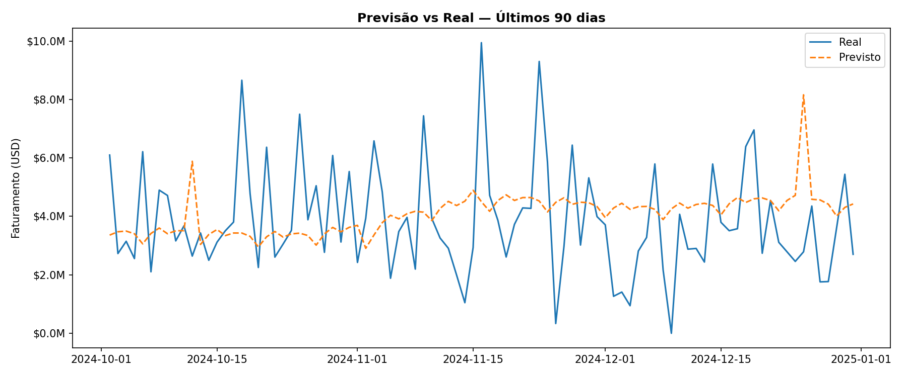
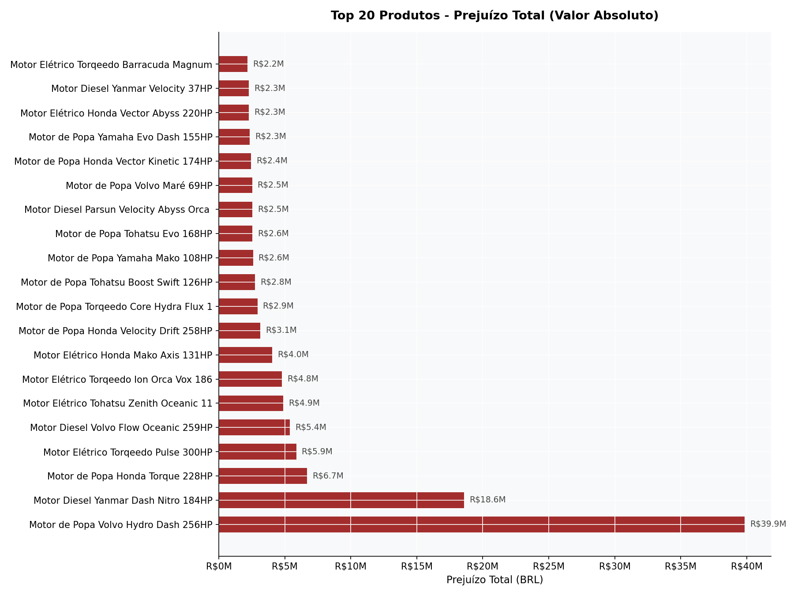
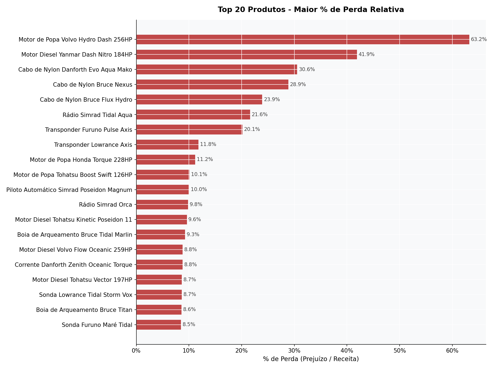
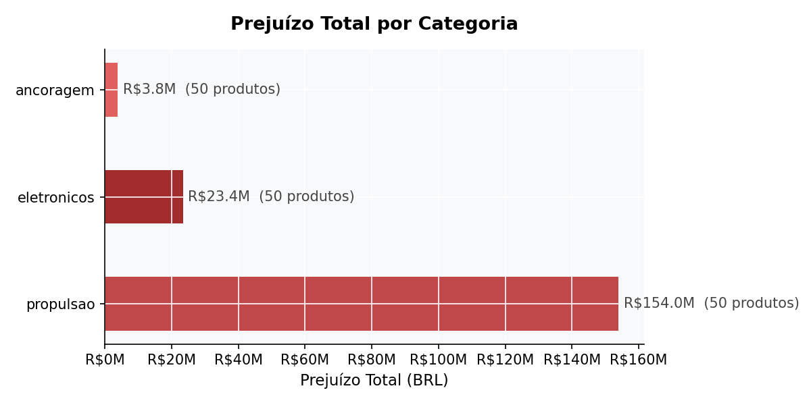
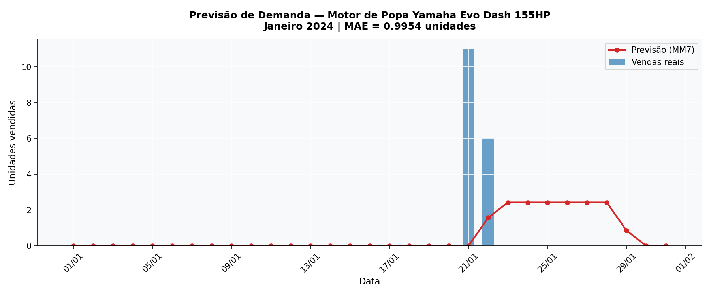

# Desafio LH Nautical

Pipeline completo de dados para a LH Nautical: limpeza de bases brutas, modelagem relacional, análise de vendas e clientes, previsão de demanda e sistema de recomendação.

## Entrega Final

Esta pasta reúne a versão consolidada da solução, organizada por questão, com as análises, scripts auxiliares, visualizações finais e o relatório consolidado da entrega.

## Insights Principais

| # | Insight | Impacto |
|---|---------|---------|
| 1 | Margem média ~80% uniforme entre categorias | Ausência de variação devido a dados sintéticos, sem produtos em prejuízo |
| 2 | Sábado tem faturamento médio 5,6% acima de domingo (o mais fraco) | Concentração de vendas no fim de semana, perfil B2B com ciclo semanal |
| 3 | 49 clientes com ~200 compras cada, garantindo perfil de distribuidor | Estratégia de retenção mais eficaz que aquisição |
| 4 | Previsão Prophet com MAPE 65% — coef. variação de 47% | Volatilidade intrínseca dos dados sintéticos |

## Visualizações Iniciais




## Visualizações — Entrega Final

As visualizações abaixo foram geradas a partir das análises finais do desafio, com foco em identificação de prejuízo e comportamento de demanda.

### Prejuízo por Produto (Valor Absoluto)


### Prejuízo por Produto (% de perda)


### Prejuízo por Categoria


### Previsão de Demanda


## Stack

- Python 3.13 · Pandas 3.0 · Prophet 1.3 · Scikit-learn 1.8
- PostgreSQL 18 · DBeaver
- Apache Airflow 3.1 (orquestração - bônus)

## Setup

```bash
conda env create -f environment.yml
conda activate lh_nautical
cp .env.example .env        # preencha as credenciais do PostgreSQL
psql -U lh_user -d lh_nautical -f sql/schema/01_create_tables.sql
python -m src.db_load
```

## Estrutura do Projeto
```
lh_nautical/
├── entregas_desafio/
│   ├── questao1/
│   ├── questao2/
│   ├── questao3/
│   ├── questao4/
│   ├── questao5/
│   ├── questao6/
│   ├── questao7/
│   ├── questao8/
│   ├── visualizacoes/
│   └── relatorio_final.py
├── data/
│   ├── raw/            ← arquivos originais, nunca modificar
│   ├── processed/      ← bases limpas
│   └── outputs/
│       ├── imgs/       ← visualizações
│       └── tables/     ← CSVs de resultado (rfm, etc.)
├── src/
│   ├── 01_eda.py
│   ├── 02_tratamento.py
│   ├── 03_analise_vendas.py
│   ├── 04_analise_clientes.py
│   ├── 05_previsao.py
│   ├── 06_recomendacao.py
│   ├── db.py
│   └── db_load.py
├── sql/
│   ├── schema/01_create_tables.sql
│   ├── views/vw_vendas.sql
│   └── queries/
├── dags/lh_nautical_pipeline.py
├── environment.yml
├── .env.example
└── .gitignore
```

## Decisões Técnicas

| Decisão | Alternativa descartada | Motivo |
|---------|----------------------|--------|
| Regex para normalizar categorias | Fuzzy matching | Escopo pequeno e controlado |
| Cotação USD/BRL fixa (R$5,10) | API de câmbio histórico | Simplificação documentada |
| Point-in-time lookup em custos | Custo mais recente | Precisão histórica nas margens |
| Co-ocorrência item-item | User-based collaborative | Apenas 49 clientes |